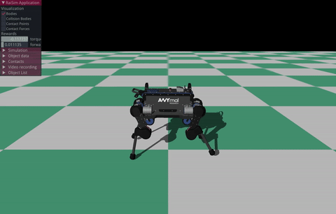
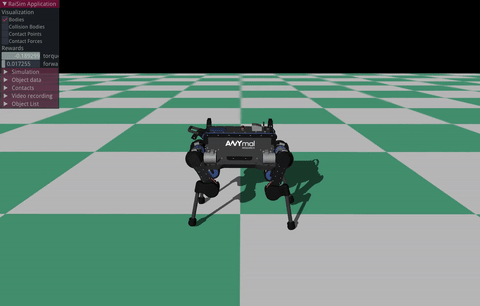
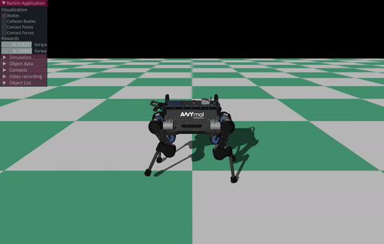

# raisimGym: RL examples using raisim

## What is raisimGym
raisimGym is an example of a gym environment using raisim. It uses stable-baselines (https://github.com/hill-a/stable-baselines) for training and pybind11 (https://github.com/pybind/pybind11) for wrapping raisim in python.

## Requirements
- Linux only. support ubuntu 16.04 and 18.04 but might work on other distributions
- g++, gcc > 6 ([how to install?](https://github.com/jhwangbo/raisimHelp/tree/master#how-to-install-latest-version-of-g))
- cmake > 3.10 ([how to install?](https://github.com/jhwangbo/raisimHelp/tree/master#how-to-install-cmake))

## Install
Please install/save everything locally to prevent corrupting your system files. We will assume that you have a single workspace where you save all repos related to raisim. 

Here we introduce two variables

- WORKSPACE: workspace where you clone your git repos
- LOCAL_BUILD: build directory where you install exported cmake libraries

You can check out our [docker file](/dockers/gpu/Dockerfile) if you are stuck.

### Python setup
1. Install python3 
    - For Ubuntu18.04 (sudo apt-get install -y cmake python3.6-dev python3-pip libpython3.6-dev)
    - For Ubuntu16.04 (sudo apt-get install -y cmake python3.5-dev python3-pip libpython3.5-dev)
2. Setup your python environment (virtualenv or conda) with Python > 3.5 

### Dependencies
Install the following dependencies
- Raisim (https://github.com/leggedrobotics/raisimLib)
- RaisimOgre (https://github.com/leggedrobotics/raisimOgre)
- yaml-cpp (sudo apt-get install libyaml-cpp-dev)

Now install pybind11 as following

```commandline
cd $WORKSPACE
git clone https://github.com/pybind/pybind11.git
cd pybind11 && git checkout v2.2.4 && mkdir build && cd build
cmake .. -DCMAKE_INSTALL_PREFIX=$LOCAL_BUILD -DPYBIND11_TEST=OFF
make install -j4
```

You might have to add LOCAL_BUILD/lib to your $LD_LIBRARY_PATH to ensure that ld finds Ogre3D shared objects.

## Workflow
1. ***Compile*** your c++ environment (instructions followed)
2. ***Run*** your learning script (instructions followed)

or use the dockerfile provided (instruction below)

## Compile
Set your compiler to g++>6.0 as following

```$commandline
export CXX=/usr/bin/g++-8 && export CC=/usr/bin/gcc-8
```

Now compile raisimGym as

```
python3 setup.py install --CMAKE_PREFIX_PATH LOCAL_BUILD --env /WHERE/YOUR/CUSTOM/ENVIRONMENT/IS
```
The "--env" directory should include a file called "Environment.hpp" which contains ENVIRONMENT class.

## Compiling examples
For the ANYmal example,
```
python3 setup.py install --CMAKE_PREFIX_PATH $LOCAL_BUILD --env anymal
```
For the Laikago example,
```
python3 setup.py install --CMAKE_PREFIX_PATH $LOCAL_BUILD --env laikago
```

## Run
You can make your own runner. To use the example runner, 
```$xslt
python3 scripts/anymal_blind_locomotion.py
```

## Using raisimGym in Docker
1. Install docker and Nvidia-docker2 ([instruction](https://github.com/jhwangbo/raisimHelp/tree/master#install-docker--nvidia-docker2)).
2. Build an image ```docker build -t raisim_gym $WORKSPACE/raisimGym/dockers/gpu```
3. Create a container using the provided docker runner ```$WORKSPACE/raisimGym/dockers/gpu/runner.bash```
4. Inside the container, compile your environment and execute your runner


## Examples of trained policies

### ANYmal
- Trained with RTX 2080 + Intel 8700K + PPO [1]
- 18 dof quadrupedal robot, 34-dimentional observation space

Initial policy | 38 seconds of training  
:-----------------------------------:|:------------------------------------:
 | 

76 seconds of training   | 112 seconds of training  
:-----------------------------------:|:------------------------------------:
 | 


## Notes
* Due to conversion between numpy and eigen, the interface class (e.g., VectorizedEnv) should use row major matrices only.

## Common issues and workarounds
- When build fails, try again after deleting the ```build``` folder

## How to contribute?
raisimGym is meant to be a minimal example. Please do not submit a pull request that contains features targeting specific applications.
Bug fix/code clean-up are welcome. 

Fork the repo, make changes and then send a pull request. Instructions can be found [here](https://help.github.com/en/articles/creating-a-pull-request-from-a-fork)

## References
[1] Schulman, John, et al. "Proximal policy optimization algorithms." arXiv preprint arXiv:1707.06347 (2017).
